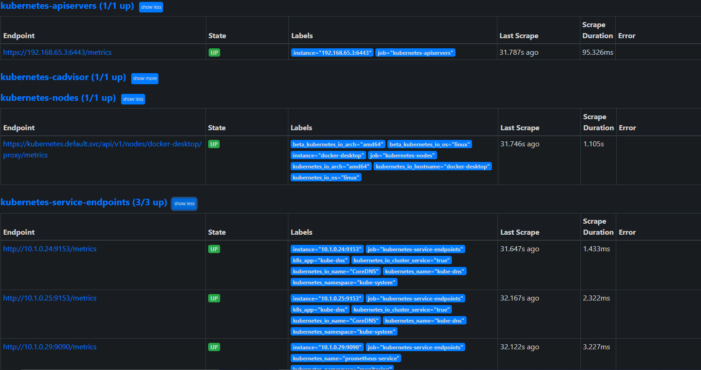

# Sentiment Analysis Web App with Prometheus Monitoring on Kubernetes

This repository contains the code and configuration for a sentiment analysis web app deployed on a Kubernetes cluster, along with Prometheus monitoring. The application is composed of several components, including an Nginx server, a Flask-based backend with a BERT model, and a MongoDB database to store user input and predictions.

## Architecture

The architecture of the web app is as follows:

- **Nginx Server**: Hosts the web app and handles incoming HTTP requests.

- **Flask Backend**: Contains the sentiment analysis logic, powered by a BERT model. It receives user input, processes it, and stores results in the MongoDB database.

- **MongoDB**: A NoSQL database used to store user input and sentiment predictions. It is configured with a persistent volume and claim to ensure data persistence.

- **Prometheus**: Monitors the entire Kubernetes cluster, like nodes and endpoints, providing valuable insights into the application's performance.

## Prerequisites

Before you begin, ensure you have the following tools and dependencies installed:

- Kubernetes Cluster (Minikube)
- kubectl (Kubernetes command-line tool)

## Expected result

Using 
```
$ kubectl get all
```
Should produce the following output (since all of them are in the default namespace)
```
NAME                                      READY   STATUS    RESTARTS   AGE
pod/backend-deployment-5f776f9fb9-4jbpf   1/1     Running   0          15s
pod/db-deployment-854c6449bb-lcb7r        1/1     Running   0          15s
pod/web-deployment-675cf99fb8-thtcz       1/1     Running   0          15s

NAME                  TYPE           CLUSTER-IP      EXTERNAL-IP   PORT(S)        AGE
service/backend       ClusterIP      10.99.231.199   <none>        8000/TCP       15s
service/db            ClusterIP      10.101.223.38   <none>        27017/TCP      15s
service/kubernetes    ClusterIP      10.96.0.1       <none>        443/TCP        6d8h
service/web-service   LoadBalancer   10.111.17.182   localhost     80:30000/TCP   15s

NAME                                 READY   UP-TO-DATE   AVAILABLE   AGE
deployment.apps/backend-deployment   1/1     1            1           15s
deployment.apps/db-deployment        1/1     1            1           15s
deployment.apps/web-deployment       1/1     1            1           15s

NAME                                            DESIRED   CURRENT   READY   AGE
replicaset.apps/backend-deployment-5f776f9fb9   1         1         1       15s
replicaset.apps/db-deployment-854c6449bb        1         1         1       15s
replicaset.apps/web-deployment-675cf99fb8       1         1         1       15s
```
The prometheus app is in a monitoring namspace which needs to be created
```
$ kubectl create namespace monitoring
```
```
$ kubectl get all --namespace=monitoring
NAME                                        READY   STATUS    RESTARTS   AGE
pod/prometheus-deployment-96898bbc9-xrzdt   1/1     Running   0          105s

NAME                         TYPE       CLUSTER-IP       EXTERNAL-IP   PORT(S)          AGE
service/prometheus-service   NodePort   10.106.209.244   <none>        8080:30001/TCP   105s

NAME                                    READY   UP-TO-DATE   AVAILABLE   AGE
deployment.apps/prometheus-deployment   1/1     1            1           105s

NAME                                              DESIRED   CURRENT   READY   AGE
replicaset.apps/prometheus-deployment-96898bbc9   1         1         1       105s
```

After the application starts, navigate to `http://localhost:80` in your web browser for the sentiment analysis, `http://localhost:30001` for Prometheus.

## Prometheus Result
